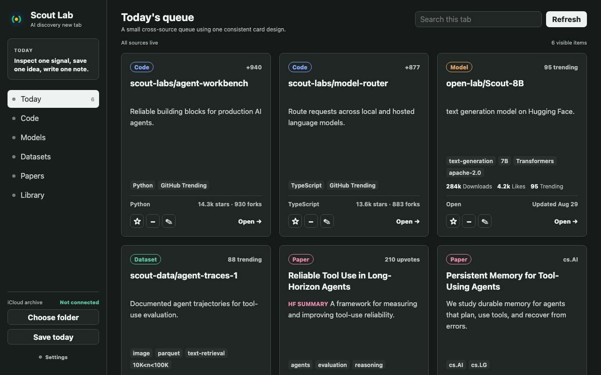
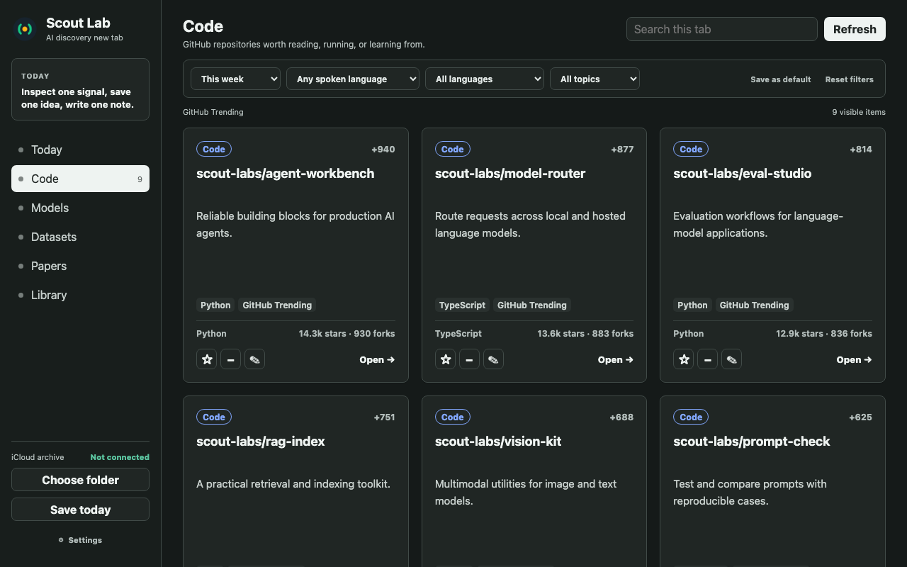
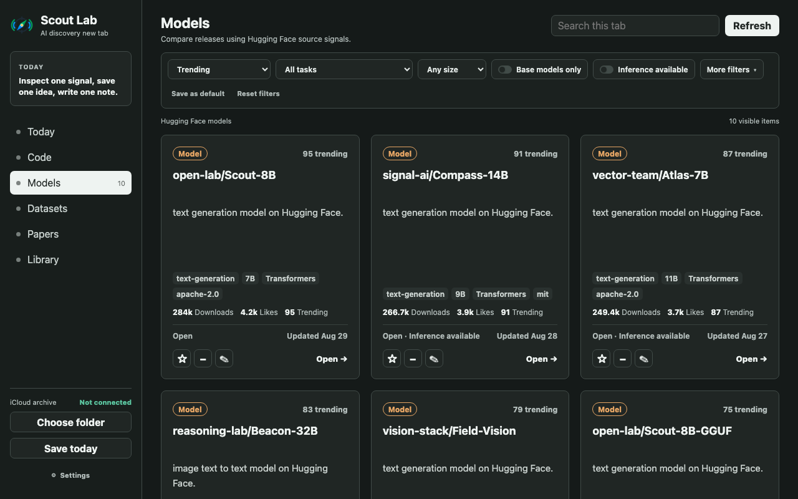

# Scout Lab

[](https://github.com/heshaojian/scout-lab/actions/workflows/quality.yml)
[](https://github.com/heshaojian/scout-lab/actions/workflows/live-sources.yml)
[](./manifest.json)
[](./LICENSE)

Scout Lab turns Chrome's new-tab page into a calm workspace for discovering AI code, models, datasets, and research.

It is built for one repeated habit: **inspect one useful signal, save one idea, and write one note.**



## What Scout Lab Does

Scout Lab brings public discovery signals from GitHub, Hugging Face, and arXiv into six focused workbenches:

| Workbench | Purpose | Source |
| --- | --- | --- |
| **Today** | A small cross-source queue for daily orientation | All configured sources |
| **Code** | Repositories the GitHub community is actively exploring | GitHub Trending |
| **Models** | Models ranked and filtered with Hugging Face-native signals | Hugging Face Models |
| **Datasets** | Training and evaluation data with source-specific facets | Hugging Face Datasets |
| **Papers** | Community attention plus a raw research feed | Hugging Face Daily Papers and arXiv |
| **Library** | Favorites and personal notes that remain available locally | Your saved Scout Lab data |

Scout Lab is intentionally not a general search page, bookmark manager, social feed, or AI news dashboard. It is a compact research bench designed for repeated daily use.

## Workbenches

### Today

Today composes a concise briefing from the current source filters. The default mix is two repositories, one model, one dataset, and two papers. You can configure 1-12 cards in Settings, with up to four cards from each source.

Today has Search and Refresh but no topic or filter bar. Detailed exploration belongs in the source workbenches.

### Code

Code mirrors the public GitHub Trending repository order and period-star values. It supports:

- Today, This week, and This month
- spoken-language filtering, including English and Chinese
- common programming-language filtering
- total stars, forks, and stars in the selected period when GitHub provides them

GitHub Trending is the only ranking source. Scout Lab never substitutes GitHub Search results when Trending is unavailable; it shows an honest unavailable state and a direct link to GitHub instead.



### Models

Models follows Hugging Face's discovery vocabulary while keeping the interface practical for daily use:

- seven source-aligned sorts, from Trending to parameter count
- all model-visible tasks grouped by modality
- parameter-size ranges
- Base models only and Inference available toggles
- library or format, license, access, compatible app, and updated-date filters
- family grouping so quantizations, fine-tunes, adapters, and merges do not overwhelm the grid

Cards expose available task, parameter, format, license, access, inference, date, like, download, trending, base-model, and variant information without changing the shared card layout.



### Datasets

Datasets supports Hugging Face-native discovery by:

- Trending, likes, downloads, creation/update time, row count, and total-size sorts
- grouped task selection
- row-count ranges and modalities
- format, type, language, license, access, and AI-topic filters

Cards surface row count, modality, format, and Benchmark or Traces metadata when the source provides it.

### Papers

Papers combines two research modes without pretending they use the same ranking signal:

- **Community** uses Hugging Face Daily Papers with community attention and source summaries.
- **Raw arXiv** reads recent `cs.AI`, `cs.LG`, or combined research with source-valid date and relevance sorting.

Community papers may show upvotes and comments. Raw arXiv cards show dates and categories, never a fabricated popularity score. Direct abstract and PDF links are preserved.

### Library

Library is local and does not make a network request. A card enters Library automatically when you favorite it or save a non-empty comment. Removing both removes it from Library.

Saved cards retain a bounded display snapshot, so they remain readable after cache expiry, source changes, reloads, and backup round trips. Hidden items also remain reviewable in Library and can be unhidden there.

Library supports:

- All, Favorites, and Notes views
- content-type and source filters
- recently updated, recently saved, and title sorting
- local search

## Daily Workflow

Every source card shares the same interaction model:

- **Favorite** keeps an item in Library and includes it in daily archives.
- **Hide** removes an item from discovery views without deleting the source item.
- **Comment** stores a personal note and keeps the item in Library.
- **Open** goes to the original source page.

The daily note at the bottom of the page autosaves in the browser as you type.

## Freshness And Caching

Opening a new tab starts cache-aware requests for Today, Code, Models, Datasets, and Papers. This warms all remote workbenches in the background, not only the visible tab.

- Remote results are cached for **six hours**.
- Cache keys include the workbench and all network-affecting filters.
- A fresh cache is reused immediately.
- An expired cache is refreshed.
- Changing a source filter creates a distinct request and cache entry.
- Simultaneous identical requests are deduplicated.
- Refresh explicitly requests current data.

If a non-Code source fails, Scout Lab prefers saved results and marks them as stale. If no saved results exist, it shows a compact source link instead of blanking the application. GitHub Code deliberately has no alternate ranking fallback.

## Reading And Appearance

Scout Lab is designed for long reading sessions rather than maximum card density.

Settings include:

- **Text size:** Standard or Large; Large is the default
- **Theme:** System, Light, or Dark
- **Density:** Comfortable or Compact
- **Start on:** the last-used or a fixed workbench
- **Open links:** foreground or background tabs
- **Today mix:** 1-12 cards across Code, Models, Datasets, and Papers
- **Workbench defaults:** save and restore source-filter defaults independently

Appearance preferences apply immediately and are restored before the application renders, avoiding a theme or text-size flash on new tabs. The responsive grid supports desktop, medium, and mobile viewports.

## Local Data, Backup, And iCloud Archive

Scout Lab keeps durable data on your device:

- settings and workbench filters
- favorites, hidden state, and comments
- Library card snapshots
- daily notes and source snapshots

Settings can export this durable data as a validated JSON backup and import it atomically. Backups do not include disposable source caches or the selected folder handle.

Scout Lab can also write a daily Markdown archive to a folder you choose through Chrome's File System Access API. To use iCloud, select a folder inside iCloud Drive and click **Save today**. Files use this structure:

```text
Selected folder/
  YYYY/
    MM/
      YYYY-MM-DD.md
```

The archive includes the visible queue, filters, favorites, hidden items, comments, source status, and daily note. Folder export is currently user-triggered; Scout Lab does not run an automatic background iCloud sync.

## Install From Source

Requirements:

- Google Chrome or another Chromium browser with Manifest V3 and the File System Access API
- a current Node.js LTS release for local development and tests

1. Clone the repository and install development dependencies:

   ```bash
   git clone https://github.com/heshaojian/scout-lab.git
   cd scout-lab
   npm ci
   ```

2. Open `chrome://extensions`.
3. Enable **Developer mode**.
4. Click **Load unpacked**.
5. Select the repository root containing `manifest.json`.
6. Open a new tab.

After pulling updates, return to `chrome://extensions` and click the extension's reload button.

## Local Preview

Scout Lab has no compile or bundling step. The development server provides the local page and fixed-target source proxies needed for browser testing:

```bash
npm run dev
```

Open [http://127.0.0.1:5179/newtab.html](http://127.0.0.1:5179/newtab.html).

The local preview covers the application UI, but unpacked-extension testing is still required for Chrome-specific behavior such as the new-tab override, background-tab opening, and directory access.

## Architecture

Scout Lab is a dependency-light, browser-native Manifest V3 extension. Source adapters normalize remote responses into one shared card contract; UI components do not depend on GitHub, Hugging Face, or arXiv response shapes.

```text
newtab.html
  src/app.js                 Application state, events, rendering, startup
  src/workbenches.js         Workbench definitions, controls, six-hour TTL
  src/settings.js            Versioned settings and preference normalization
  src/theme-init.js          Pre-render appearance restoration
  src/services/
    query.js                 Source requests, URL validation, stable cache keys
    feeds.js                 Fetching, normalization, caching, failure handling
    normalizers.js           GitHub, Hugging Face, and arXiv card adapters
    startup.js               Concurrent startup cache warming
    storage.js               Local preferences, annotations, notes, snapshots
    library.js               Saved-card membership, filtering, migration
    backup.js                Validated JSON export/import
    archive.js               Folder permission and Markdown file writing
    archiveFormat.js         Safe daily Markdown generation
  src/ui/                    Shared cards, controls, and Settings drawer
  src/styles/                Appearance, source controls, and responsiveness
```

### Data Flow

1. Pre-render code restores theme, text size, and density.
2. Settings and annotations load from browser storage.
3. Startup creates one cache-aware request for every remote workbench.
4. The selected workbench renders a trusted daily snapshot when available.
5. A stable query key checks the six-hour cache or fetches the public source.
6. Source adapters normalize results into shared cards.
7. Results update the grid, query cache, and current daily snapshot.
8. Favorites and comments preserve safe card snapshots in Library.

## Development And Verification

Install the pinned dependencies once:

```bash
npm ci
```

Run the deterministic release gates:

```bash
npm run check
npm run test:coverage
npm run test:e2e
npm audit --audit-level=high
```

Run bounded read-only checks against the current public sources:

```bash
npm run test:live
```

Create and smoke-test the versioned Chrome Web Store archive:

```bash
npm run test:release
```

For release `1.0.4`, the package is written to `dist/scout-lab-1.0.4.zip`. The smoke test loads that ZIP as an actual extension, opens `chrome://newtab`, and verifies live GitHub Trending order and period-star parity.

The repository keeps unit, integration, real-browser, live-source, package, and acceptance tests under version control. See [Testing Scout Lab](./docs/testing.md) for the test map, CI behavior, coverage requirements, and maintenance rules.

## Privacy And Permissions

Scout Lab has no account, publisher-operated backend, analytics, advertising, or tracking. The publisher cannot access your settings, annotations, notes, backups, archives, or cached results.

Host permissions are limited to the public sources displayed by the extension:

- `https://github.com/*` for GitHub Trending
- `https://huggingface.co/*` for Models, Datasets, and Daily Papers
- `https://export.arxiv.org/*` for arXiv Atom feeds

See the [Privacy Policy](./PRIVACY.md) for data storage, source-request, deletion, and Limited Use details.

## Project Documentation

- [Product design](./docs/product-design.md)
- [UI design](./docs/ui-design.md)
- [Testing and release gates](./docs/testing.md)
- [Chrome Web Store listing](./docs/store-listing.md)
- [Browser acceptance matrix](./tests/acceptance/browser-matrix.md)
- [Privacy policy](./PRIVACY.md)
- [Implementation designs and plans](./docs/superpowers/)

## Support And Contributing

Use [GitHub Issues](https://github.com/heshaojian/scout-lab/issues) for bugs and feature proposals. Changes should include the nearest automated tests, update browser acceptance coverage when user workflows change, and pass the local release gates before a pull request.

## License

Scout Lab is available under the [MIT License](./LICENSE).
